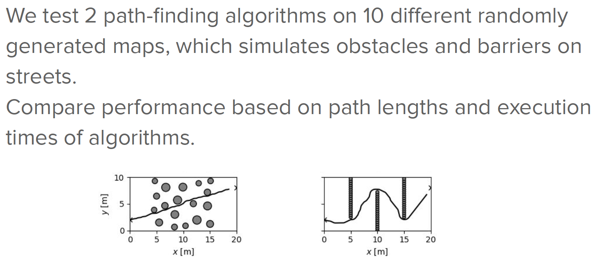
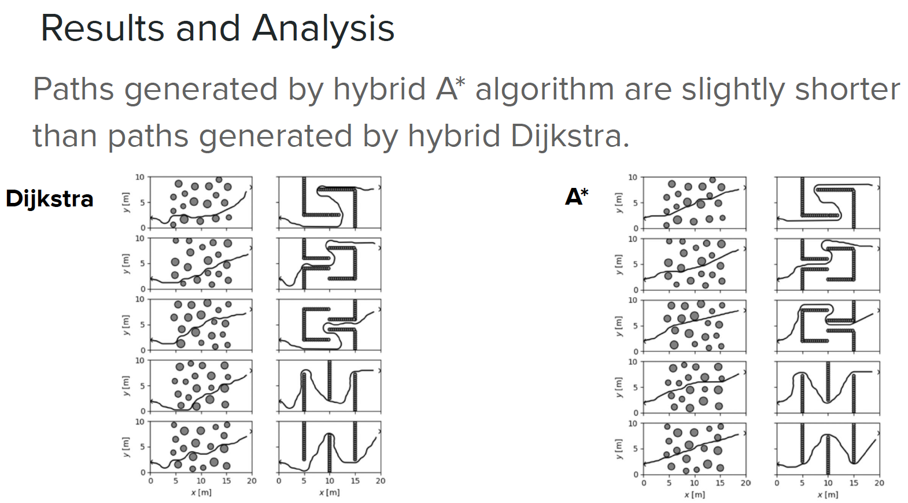

## II2202 Project: Comparison of Grid Based Search Path Planning Dijkstra and A* Algorithm
 The purpose of this project is to implement a state-of-the-art hybrid planning algorithm (hybrid A*) that is widely used in auto-driving applications for path exploration. The performance and efficiency of the algorithm is evaluated and compared with a more traditional planning algorithm (hybrid Dijkstra) experimentally in order to examine the effect of heuristic in the context of hybrid systems for autonomous vehicle simulation.

 <em>Disclaimer: The main purpose is to implement and evaluate the core path-planning algorithms for self-driving applications.The simulation environment, e.g., mazes, and the plot modules are provided by the Github repository (https://github.com/cisprague/dubins.git) of course "DD2410 Introduction to Robotics" offered by KTH University.<em>

 Run the simulation by executing following commands within hybrid_A*_and_Dijkstra directory:

```bash
# run the simulation
>>> python3 main.py
```

Run the simulation with additional arguments:
```bash
# show a plot
python3 main.py -p
# print trajectory information
python3 main.py -v
```
--------------------------------

